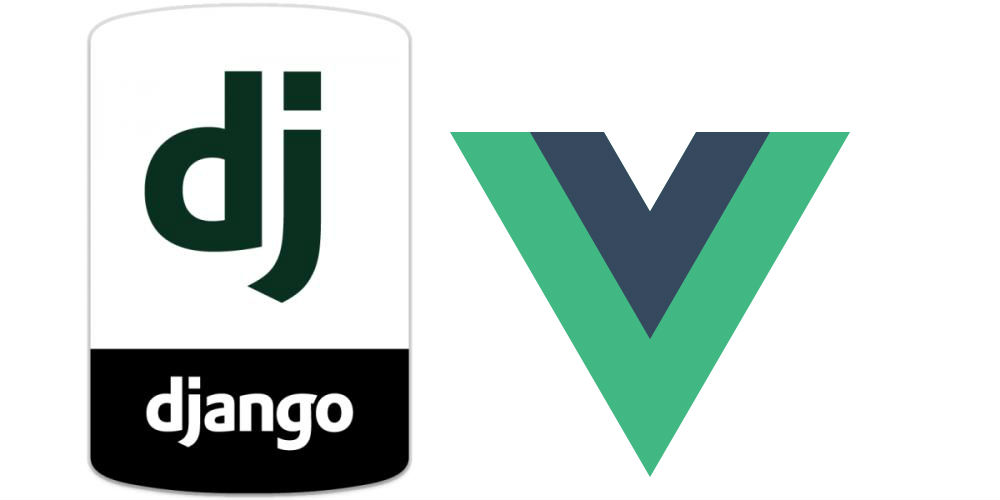
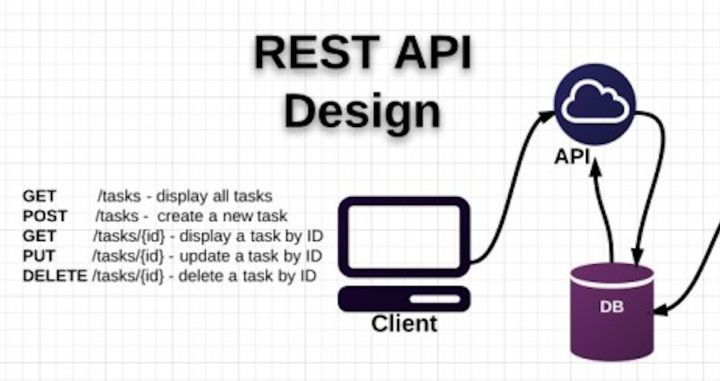
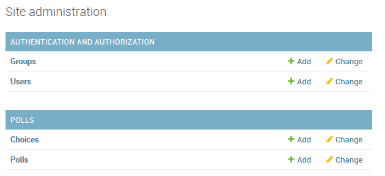
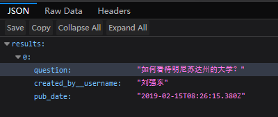
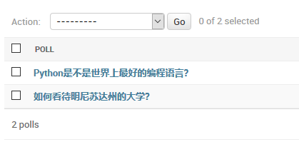
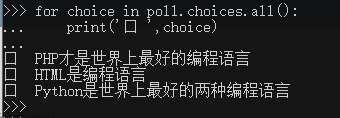
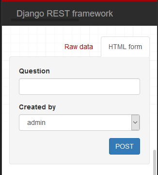
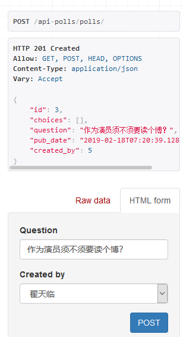
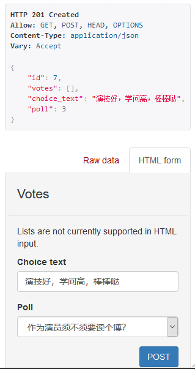

# <center>重构Djagno官方教程为RESTful网络应用</center>
  
# 系列文章介绍
本系列文章将详细介绍将Django官方引导教程中的投票项目改写为RESTful网络服务。Django官方教程地址https://docs.djangoproject.com/zh-hans/2.1/intro/tutorial01/


# Step-1：RESTful与Django
## 内容提要
* 什么是RESTful API
* 为什么要RESTful
* Python Web框架如何进行RESTful开发
* Django REST Framework
* 不同HTTP请求方法如何发生作用
* 用Django及DRF编写API操作数据库

## 什么是RESTful API
REST是Representational State Transfer的缩写（不要试图去翻译它，你会发现三个字都认识，但合在一起就不知道它说啥了）。
要理解REST，首先在明确这几点：
* REST不是平台，不是软件，而是一套规范、一套倡议。就如同HTTP是一套规范，Google Python Code Style、PEP8、阿里Java开发规范一样是一套倡议。
* URL定位资源，HTTP动词（GET,POST,DELETE,DETC）描述操作（@lvony ）。用我们熟悉的Python HTTP请求库requests来举例，requests.get('http://some_books_tore.com/books/1')，可以猜测它是访问序号为1的book（资源），并采用get方法取回（动作）；requests.delete('http://some_books_tore.com/books/1')，则猜测它可能是访问序号为1的book，并删除它。  


* Server和Client之间传递某资源的一个表现形式，比如用JSON，XML传输文本，或者用JPG，WebP传输图片等。当然还可以压缩HTTP传输时的数据（on-wire data compression）。
* 用 HTTP Status Code传递Server的状态信息。比如最常用的 200 表示成功，500 表示Server内部错误等。
以上部分内容引用自@覃超 https://www.zhihu.com/question/28557115/answer/48094438
更多信息可以参考此回答。

## 为什么要RESTful
* 利于前后端分离（减少互相等待、互相扯皮、松耦合）
* 一些场景下不需要前端
* 跨平台
更多信息可以上网搜索，也可以参考上一节提到的知乎回答。
这里结合自身说一点体验，前几天在Github上看到一个博客项目，觉得很漂亮，它前端用Vue.js，后端用的Node.js。我很喜欢它漂亮的前端界面，但对Node.js了解甚少。由于它前后端分离的设计，我把它的前端项目下载下来，后端用Python稍微重写下，就可以用了。你可以想象，一个不了解jsp的人，要如何把Java站点改写成Python，一个不懂jinja的人，如何把Flask、Django站点用其它语言改写。也就是说，前后端分离的方式，对代码重构也有着重要作用。REST是前后端分离的一种规范，如果第一次接触“前后端分离”，不妨就从REST开始。

## Python Web框架如何进行RESTful开发
Python的Web框架都可以进行原生的RESTful API开发，但是对于一些流行框架，已经有一些插件可以辅助我们更方便地进行Python RESTful Web Service开发了。在Django中，我们有Django Rest Framework（如果你地相关版块看到DRF，说的就是这个了），在Flask中，我们有Flask-RESTful。
在本文中，将介绍如何使用Django结合Django REST Framework编写和API。在以后的文章中，希望能介绍如何使用Flask、Tornado等其他框架进行RESTful Web Service开发。

## 什么是Django REST Framework
Django REST framework，也就是DRF，可以让我们更方便地用Django编写RESTful API。它可以托管Django中的model和view，解析HTTP请求，对在京的资源进行操作。在本文中，我们会用Dajngo REST Framework编写一个简单的应用，达到使用API操作SQLite数据库的目的。在以后的文章中，将介绍使用Django REST Framework进行更复杂的数据库操作。

## 理解不同HTTP请求方法发挥什么作用
假设我们有一个模型（理解为数据库的表），其中存放书籍信息，books。
GET，可用从表中取得书籍信息，可以取得所有书籍信息，也可以只取得其中一本书籍的信息。如果你开发过爬虫或对信息分发网站（安居客、企查查、黄页等）比较留意，就很容易理解为“列表页”与“详细页”关系。
POST，在表中新建一个书籍信息的记录。
PUT，对已经存在的书籍的记录作出修改，比如书籍是否在馆、书籍累计被借阅次数等信息，是动态更新的。
DELETE，从表中删除一条书籍记录，比如书籍损毁了，以后没有了。
OPTIONS，用于获取目的资源所支持的通信选项。

## 开发环境：Windows，Linux，虚拟机，还是WSL？
本项目的开发环境可以在Windows、常见的Linux发行版等。你可以直接在Windows下搭建开发环境，也可以使用一台虚拟机。这里推荐你尝试一下WSL，如果不知道什么是WSL，可以上网搜一下，尝试安装使用。不推荐使用百度搜索，上一次用百度搜搜WSL得到的结果还是“汪苏泷”。  
建议使用Python虚拟环境（你可以使用virtualenv或anaconda等）。  

## 安装django、djangorestframework、requests

```bash
> pip install django==2.1 djangorestframework requests
```
之所以指定Django的版本，一是因为这个版本比较新，不想做过时的教程（毕竟你一来就看到django 1.1啥的，肯定是立马把这页面给关了）；二是因为这个版本的Django文档的官方中文版本（旧版本没有中文文档，新版本的中文文档还没更新）。为什么要有中文文档？一是因为大多数学习者阅读中文效率还是要高于阅读英文的，二是因为，一般读者读英文文档读不下去时，会去找一些中文文档，如果此时没有官方版本的，就有可能误读一些质量不高的第三方译本，又费时又费力。
requests可以用来测试我们的API，是可选的。

# Step-2：创建项目和应用

## 新建Django项目和App
新建一个项目文件夹，激活虚拟环境，新建一个项目。
```bash
> django-admin startproject pollsapi
```
```bash
── pollsapi
   ├── manage.py
   └── pollsapi
       ├── __init__.py
       ├── settings.py
       ├── urls.py
       └── wsgi.py
```
进行数据库迁移。
```bash
> python manage.py migrate
```
创建一个名为polls的应用。
```bash
>python manage.py startapp polls
```
为这个应用创建模型。
```python
# in polls/models.py
from django.db import models
from django.contrib.auth.models import User


class Poll(models.Model):
    question = models.CharField(max_length=100)
    created_by = models.ForeignKey(User, on_delete=models.CASCADE)
    pub_date = models.DateTimeField(auto_now=True)
    
    def __str__(self):
        return self.question


class Choice(models.Model):
    poll = models.ForeignKey(Poll, related_name='choices', on_delete=models.CASCADE)
    choice_text = models.CharField(max_length=100)
    
    def __str__(self):
        return self.choice_text


class Vote(models.Model):
    choice = models.ForeignKey(Choice, related_name='votes', on_delete=models.CASCADE)
    poll = models.ForeignKey(Poll, on_delete=models.CASCADE)
    voted_by = models.ForeignKey(User, on_delete=models.CASCADE)

    class Meta:
        unique_together = ("poll", "voted_by",)
```
将应用添加到安装列表。
```python
# in settings.py
INSTALLED_APPS = [
    ...
    
    'rest_framework',
    'polls',
]
```
数据库迁移。
```bash
> python manage.py makemigrations polls
> python manage.py migrate
```
进行url分发
```python
# in pollsapi/urls.py
from django.contrib import admin
from django.urls import path, include


urlpatterns = [
    path('admin/', admin.site.urls),
    path('api-polls/', include('polls.urls')),  # 将api-polls的请求分发到polls应用进行再分发
]
```
进行url再分发
```python
# in polls/urls.py
urlpatterns = [
]  # 此时应用还没有任何分发能力
```

## 将模型注册到admin以方便管理
```python
# in polls/admin.py
# Register your models here.
from django.contrib import admin
from .models import Poll, Choice


admin.site.register(Poll)
admin.site.register(Choice)
```
## 项目代码
目前为止的项目代码可见于https://gitee.com/pythonista/rest_django_tutorial/tree/b1

# Step-3：使用原生Django编写API
我们设计两个API，用以返回JSON格式的数据.  
• /polls/       GETs list of Poll  
• /polls/<id>/  GETs data of a specific Poll  
## 编写视图
```python
# in polls/views.py
from django.shortcuts import render, get_object_or_404
from django.http import JsonResponse
from .models import Poll


def polls_list(request):
    MAX_OBJECTS = 20
    polls = Poll.objects.all()[:MAX_OBJECTS]  # 从Poll模型（对应数据库中的表）中取出前20条记录
    data = {"results": list(polls.values("question", "created_by__username", "pub_date"))}  # 以dict形式组织数据
    return JsonResponse(data)  # JsonResponse与Django的HttpResponse类似，但它响应的content-type=application/json.


def polls_detail(request, pk):
    poll = get_object_or_404(Poll, pk=pk)  # 获取对象实例或返回404状态
    data = {"results": {
        "question": poll.question,
        "created_by": poll.created_by.username,
        "pub_date": poll.pub_date
    }}
    return JsonResponse(data)
```
进行url分发
```python
from django.urls import path
from .views import polls_list, polls_detail


urlpatterns = [
    path("polls/", polls_list, name="polls_list"),
    path("polls/<int:pk>/", polls_detail, name="polls_detail"),
]
```
## 创建用户
```bash
> python manage.py createsuperuser
```
创建好超级用户后，可以登录用用后台http://127.0.0.1:8000/admin/ ，创建其他用户。  

  

创建完用户后，再添加polls和choices。  

  

## 查看API
打开浏览器，访问http://127.0.0.1:8000/api-polls/
可以看到你刚刚创建的poll

  

## 为什么需要DjangoRESTFramework
我们可以用原生的Django编写API，为什么还要DjangoRESTFramework呢？因为，大多时候，请求控制（认证、权限、频率）、序列化等，都是在做一些重复的工作，DRF大大简化了API的编写。

# Step-4：序列化与反序列化
## 什么是序列化与反序列化
serialization and deserialization 我们称为序列化与反序列化。
序列化 (Serialization)是将对象的状态信息转换为可以存储或传输的形式的过程。在序列化期间，对象将其当前状态写入到临时或持久性存储区。以后，可以通过从存储区中读取或反序列化对象的状态，重新创建该对象。
我们把JSON这样的支持取数操作的数据称为结构数据，把bytes、string这样的不支持取数操作的数据称非结构数据。从非结构数据向结构数据转化称为反序列化；从结构数据向非结构数据的转化，称为序列化。
显然，Django的Model的实例是一种结构数据，它保存了结构化的信息。这种结构化的信息无法被其他组件使用（比如你让vue app来读Django的Model就是不可能的），所以我们要将其序列化，再传给其他组件或用户。vue从前端传进来信息，是靠url表达，url也是一串字符串而已，Djagno 的Model无法从一串字符串中拿到要增删改查的信息，所以外部信息进来时，要反序列化。
我们的RESTful API能够在前后端打交道，就必须有序列化和反序列化的能力。序列化与反序列化用JSON来表达。

## 编写序列化器
```python
from rest_framework import serializers

from .models import Poll, Choice, Vote


class VoteSerializer(serializers.ModelSerializer):
    # 继承于serializers.ModelSerializer（模型序列化器）
    # 用以对模型的字段进行序列化
    class Meta:
        model = Vote  # 指定要序列化的模型
        fields = '__all__'  # 指定要序列化的字段，这里序列化所有字段


class ChoiceSerializer(serializers.ModelSerializer):
    class Meta:
        model = Choice
        fields = '__all__'
    
    votes = VoteSerializer(many=True, required=False)  # 序列化器的嵌套


class PollSerializer(serializers.ModelSerializer):
    choices = ChoiceSerializer(many=True, read_only=True, required=False)

    class Meta:
        model = Poll
        fields = '__all__'
```
代码解释：
class ChoiceSerializer中，使用了序列化器的嵌套（即一个序列化器中包含另一个序列化器的实例作为此序列化器的字段）。Vote模型和Choice模型有关联关系，对有关联关系的模型进行序列化，称为序列化关系模型，或称为关系模型的序列化。关系模型的序列化，必须有方法来描述关系。DjangoRESTFramework提供了五种描述关系的办法（这里说成“办法”，而不说成方法，以免跟函数方法的“方法”混淆）。
* 用主键描述关系；
* 用唯一性字段描述关系；
* 用实体间的超链接描述关系；
* 用关系的嵌套描述关系；
* 用开发者自定义的方式描述关系。  

此处用的是第4种办法,用嵌套描述关系。Choice模型中有两个字段，
```python
poll = models.ForeignKey(Poll, related_name='choices', on_delete=models.CASCADE)
choice_text = models.CharField(max_length=100)
```
其中choice_text，作为表中的记录来理解，可以理解为字符串；作为一个Python对象来理解，是一个models.CharField的实例。  
poll，作为表中的记录来理解，可以理解为一个外键，实际上，在数据库中，记录的值是Poll对应的表中的记录的主键的值。但是，作为一个Python对象，不能把它理解为一个具体的值，而应该理解为一个Poll类的实例。这很重要。poll是一个模型的实例，所以可以序列化，所以可以用嵌套来描述这种关联关系，所以PollSerializer中的choices字段，是一个序列化器的实例。

## 一个模型序列化器能为我们做什么呢？
一个模型序列化器为我们提供了许多方法，如以下几个重要方法：  
* .is_valid(self, ..) 方法，当对模型进行create/update操作时，它能检查提交的数据的有效性。
instance.
* .save(self, ..) 方法，它能够将模型实例中的数据保存到表中。
* .create(self, validated_data, ..)方法，能够创建模型实例。可以重写这个方法以实现自定义的 create 行为。
* .update(self, instance, validated_data, ..)方法，可以更新模型实例。可以重写这个方法以实现自定义的 update 行为。

## 使用模型序列化器操作模型
```python
# 进入Django Shell
> python manage.py shell
(InteractiveConsole)
>>> from polls.serializers import PollSerializer
>>> from polls.models import Poll
# 实例化一个模型序列化器
>>> poll_serializer = PollSerializer(data={'question': 'Python是不是最好的编程语言？', 'created_by': 1 })
# 检查数据的有效性
>>> poll_serializer.is_valid()
True
# 保存
>>> poll = poll_serializer.save()
>>> poll.pk
2
# 修改记录
>>> poll_serializer = PollSerializer(instance=poll, data={'question': 'Python是不是世界上最好的编程 语言？', 'created_by': 1 }) )
>>> poll_serializer.is_valid()
True                      )
>>> poll = poll_serializer.save()
>>> poll
<Poll: Python是不是世界上最好的编程语言？>
```
登录后台，可以看到，已经多了一条poll记录。

  

可以尝试使用模型序列化器为这个poll添加choice。    

    

## 项目代码
目前为止的项目代码可见于https://gitee.com/pythonista/rest_django_tutorial/tree/b2

# Step-5：基于DRF的视图类的视图
## 使用APIView
我们将使用DRF中的APIView来重写之前编写的两个视图。我们了解过Django中的基于类的视图，APIView封装和继承了Django原生的视图类，并额外提供了部分功能。
新建一个polls/apiview.py，编写代码如下：
```python
# in polls/apiview.py
from rest_framework.views import APIView
from rest_framework.response import Response
from django.shortcuts import get_object_or_404


from .models import Poll, Choice
from .serializers import PollSerializer


class PollList(APIView):
    def get(self, request):
        polls = Poll.objects.all()[:20]  # 从Poll模型对应的表中取出所有记录，并切片前20条记录。这是一个QuerySet类的实例，其中包含了如何取数的信息。
        serialized = PollSerializer(polls, many=True)  # 利用QuerySet实例化一个序列化器。many=True表示，这是对多条记录的请求。
        return Response(serialized.data)  # serialized.data是一个有序字典对象


class PollDetail(APIView):
    def get(self, request, pk):
        poll = get_object_or_404(Poll, pk=pk)  # get_object_or_404要么取回记录实例要么返回404 Not Found状态
        serialized = PollSerializer(poll)  # 序列化这个记录实例
        return Response(data=serialized.data)
```
我们再把url指向对应的新的视图。
```python
# in polls/ur.py
from django.urls import path
# from .views import polls_list, polls_detail
from .apiview import PollList, PollDetail


urlpatterns = [
    path("polls/", PollList.as_view(), name="polls_list"),  # .as_view()访求返回的是一个函数。以.as_view()作为入口，这个序列化器实例会进行请求方法分发、执行视图函数（方法）等操作。
    path("polls/<int:pk>/", PollDetail.as_view(), name="polls_detail"),
]
```
## 使用DRF通用视图简化代码
检查之前写的视图，确认它是可以正常工作的，但是代码有点冗余和麻烦。DRF为我们提供了通用视图，它预封装了许多有用的功能。
```python
# in polls/apiview.py
from rest_framework import generics

from .models import Poll, Choice
from .serializers import PollSerializer, ChoiceSerializer, VoteSerializer


class PollList(generics.ListCreateAPIView):
    queryset = Poll.objects.all()
    serializer_class = PollSerializer


class PollDetail(generics.RetrieveUpdateDestroyAPIView):
    queryset = Poll.objects.all()
    serializer_class = PollSerializer
```
对数据库的操作，一般称为CRUD或CRUDL，即Create（增加记录），Retrieve或Read（查询单条记录），Update（修改记录），Destroy或Delete（删除记录）。在本节之前，我们编写的视图中已经支持了List操作和Retrieve操作，还不能支持其他操作。
我们从generics.ListCreateAPIView类的名字上可以看出，它支持List、Create两种视图功能。其中List对应的HTTP动词是GET，Create对应的HTTP动态是POST。
从generics.RetrieveUpdateDestroyAPIView的名字可以看出，它支持Retrieve、Update、Destroy，它可以取回单条记录，修改单条记录，，删除单条记录。Retrieve、Update、Destroy对应的HTTP动词分别是GET、PUT、DELETE。
这些通用视图类是如何支持多种操作的呢？这涉及到多继承（也称新式类，也称混合类、混合继承等）。在此不多述，在以后的文章中，希望能对通用视图类展开来说。
现在我们打开http://127.0.0.1:8000/api-polls/polls/，可以发现，原来的数据仍能取回，而网页下方，出现了一个可以提交POST请求的表单。  
    
说明我们的视图是支持POST的视图了。

## 编写其它视图
```python
# in polls/apiview.py
from rest_framework import generics

from .models import Poll, Choice
from .serializers import PollSerializer, ChoiceSerializer, VoteSerializer


class PollList(generics.ListCreateAPIView):
    queryset = Poll.objects.all()
    serializer_class = PollSerializer


class PollDetail(generics.RetrieveUpdateDestroyAPIView):
    queryset = Poll.objects.all()
    serializer_class = PollSerializer


class ChoiceList(generics.ListCreateAPIView):
    queryset = Choice.objects.all()
    serializer_class = ChoiceSerializer
    
    
class CreateVote(generics.CreateAPIView):
    # Vote只须要被创建
    serializer_class = VoteSerializer
```

## 编写polls/urls.py进行url分发。
```python
# in polls/urls.py
from django.urls import path
# from .views import polls_list, polls_detail
from .apiview import PollList, PollDetail, ChoiceList, CreateVote


urlpatterns = [
    path("polls/", PollList.as_view(), name="polls_list"),
    path("polls/<int:pk>/", PollDetail.as_view(), name="polls_detail"),
    path('choices/', ChoiceList.as_view(), name='choice_list'),
    path('vote/', CreateVote.as_view(), name='create_view')
]
```

## 尝试POST请求
尝试用POST新建一个问题。  
    

用POST为这个问题添加选项。  
    
细心的话可以发现，POST成功后，立马返回了POST成功的数据。

## 项目代码
目前为止的项目代码可见于https://gitee.com/pythonista/rest_django_tutorial/tree/b3

# Step-last：后记
## 系列文章风格
系列文章会以低零基础、手把手、逐行解释、连续完整的风格进行写作。
* 低零基础：降低文章阅读门槛，使接触Python Web开发时间较短的读者也能有所收获。本人本职是从事数据开发与数据挖掘，所以对低零基础深有体会。
* 手把手：一些基础操作，也会说明。如本文中，包括安装库等操作也会进行说明。
* 逐行解释：对代码进行解释，以白居易写诗风格为目标（传说白居易会把自己的诗解释给街头妇人，直到连不懂文化的妇人也能明白，完成创作）。
* 连续完整：连续是指，文章是成系列的，上文下文之间是有着联系的，项目是连续的。代码托管也体现了这一点，不同的文章，对应不同的git标签或分支，也体现了不同的进度。完整是指，项目是完整的，文章也是完整的。文章可以当作博文来读，也可以当作教程来读。


## 文章列表
* Vue+Django构建前后端分离项目（选读）：
https://zhuanlan.zhihu.com/p/54776124
* Python构建RESTful网络服务[Django篇：基于函数视图的API]：https://zhuanlan.zhihu.com/p/55562891
* Python构建RESTful网络服务[Django篇：使用PostgreSQL替代SQLite]（选读）：https://zhuanlan.zhihu.com/p/55903530
* Python构建RESTful网络服务[Django篇：基于类视图的API]：https://zhuanlan.zhihu.com/p/57024322
## 参考文献
Hillar G C. Building RESTful Python Web Services[J]. Birmingham, UK: Packt Publishing Ltd, 2016.


