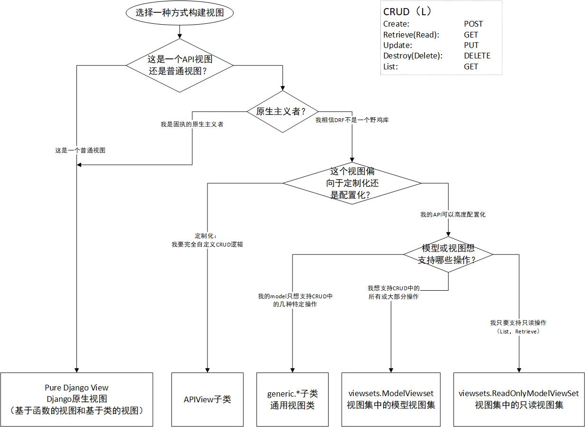

# <center>重构Djagno官方教程为RESTful网络应用</center>
  
# 系列文章介绍
本系列文章将详细介绍将Django官方引导教程中的投票项目改写为RESTful网络服务。Django官方教程地址https://docs.djangoproject.com/zh-hans/2.1/intro/tutorial01/


# Step-1：RESTful与Django
## 内容提要
* 什么是RESTful API
* 为什么要RESTful
* Python Web框架如何进行RESTful开发
* Django REST Framework
* 不同HTTP请求方法如何发生作用


## 什么是RESTful API
REST是Representational State Transfer的缩写（不要试图去翻译它，你会发现三个字都认识，但合在一起就不知道它说啥了）。
要理解REST，首先在明确这几点：
* REST不是平台，不是软件，而是一套规范、一套倡议。就如同HTTP是一套规范，Google Python Code Style、PEP8、阿里Java开发规范一样是一套倡议。
* URL定位资源，HTTP动词（GET,POST,DELETE,DETC）描述操作（@lvony ）。用我们熟悉的Python HTTP请求库requests来举例，requests.get('http://some_books_tore.com/books/1')，可以猜测它是访问序号为1的book（资源），并采用get方法取回（动作）；requests.delete('http://some_books_tore.com/books/1')，则猜测它可能是访问序号为1的book，并删除它。  


* Server和Client之间传递某资源的一个表现形式，比如用JSON，XML传输文本，或者用JPG，WebP传输图片等。当然还可以压缩HTTP传输时的数据（on-wire data compression）。
* 用 HTTP Status Code传递Server的状态信息。比如最常用的 200 表示成功，500 表示Server内部错误等。
以上部分内容引用自@覃超 https://www.zhihu.com/question/28557115/answer/48094438
更多信息可以参考此回答。

## 为什么要RESTful
* 利于前后端分离（减少互相等待、互相扯皮、松耦合）
* 一些场景下不需要前端
* 跨平台
更多信息可以上网搜索，也可以参考上一节提到的知乎回答。
这里结合自身说一点体验，前几天在Github上看到一个博客项目，觉得很漂亮，它前端用Vue.js，后端用的Node.js。我很喜欢它漂亮的前端界面，但对Node.js了解甚少。由于它前后端分离的设计，我把它的前端项目下载下来，后端用Python稍微重写下，就可以用了。你可以想象，一个不了解jsp的人，要如何把Java站点改写成Python，一个不懂jinja的人，如何把Flask、Django站点用其它语言改写。也就是说，前后端分离的方式，对代码重构也有着重要作用。REST是前后端分离的一种规范，如果第一次接触“前后端分离”，不妨就从REST开始。

## Python Web框架如何进行RESTful开发
Python的Web框架都可以进行原生的RESTful API开发，但是对于一些流行框架，已经有一些插件可以辅助我们更方便地进行Python RESTful Web Service开发了。在Django中，我们有Django Rest Framework（如果你地相关版块看到DRF，说的就是这个了），在Flask中，我们有Flask-RESTful。
在本文中，将介绍如何使用Django结合Django REST Framework编写和API。在以后的文章中，希望能介绍如何使用Flask、Tornado等其他框架进行RESTful Web Service开发。

## 什么是Django REST Framework
Django REST framework，也就是DRF，可以让我们更方便地用Django编写RESTful API。它可以托管Django中的model和view，解析HTTP请求，对在京的资源进行操作。在本文中，我们会用Dajngo REST Framework编写一个简单的应用，达到使用API操作SQLite数据库的目的。在以后的文章中，将介绍使用Django REST Framework进行更复杂的数据库操作。

## 理解不同HTTP请求方法发挥什么作用
假设我们有一个模型（理解为数据库的表），其中存放书籍信息，books。
GET，可用从表中取得书籍信息，可以取得所有书籍信息，也可以只取得其中一本书籍的信息。如果你开发过爬虫或对信息分发网站（安居客、企查查、黄页等）比较留意，就很容易理解为“列表页”与“详细页”关系。
POST，在表中新建一个书籍信息的记录。
PUT，对已经存在的书籍的记录作出修改，比如书籍是否在馆、书籍累计被借阅次数等信息，是动态更新的。
DELETE，从表中删除一条书籍记录，比如书籍损毁了，以后没有了。
OPTIONS，用于获取目的资源所支持的通信选项。

## 开发环境：Windows，Linux，虚拟机，还是WSL？
本项目的开发环境可以在Windows、常见的Linux发行版等。你可以直接在Windows下搭建开发环境，也可以使用一台虚拟机。这里推荐你尝试一下WSL，如果不知道什么是WSL，可以上网搜一下，尝试安装使用。不推荐使用百度搜索，上一次用百度搜搜WSL得到的结果还是“汪苏泷”。  
建议使用Python虚拟环境（你可以使用virtualenv或anaconda等）。  

## 安装django、djangorestframework、requests

```bash
> pip install django==2.1 djangorestframework requests
```
之所以指定Django的版本，一是因为这个版本比较新，不想做过时的教程（毕竟你一来就看到django 1.1啥的，肯定是立马把这页面给关了）；二是因为这个版本的Django文档的官方中文版本（旧版本没有中文文档，新版本的中文文档还没更新）。为什么要有中文文档？一是因为大多数学习者阅读中文效率还是要高于阅读英文的，二是因为，一般读者读英文文档读不下去时，会去找一些中文文档，如果此时没有官方版本的，就有可能误读一些质量不高的第三方译本，又费时又费力。
requests可以用来测试我们的API，是可选的。

# Step-2：创建项目和应用
## 内容提要
* 创建Django项目与应用
* 创建模型

## 新建Django项目和App
新建一个项目文件夹，激活虚拟环境，新建一个项目。
```bash
> django-admin startproject pollsapi
```
```bash
── pollsapi
   ├── manage.py
   └── pollsapi
       ├── __init__.py
       ├── settings.py
       ├── urls.py
       └── wsgi.py
```
进行数据库迁移。
```bash
> python manage.py migrate
```
创建一个名为polls的应用。
```bash
>python manage.py startapp polls
```
为这个应用创建模型。
```python
# in polls/models.py
from django.db import models
from django.contrib.auth.models import User


class Poll(models.Model):
    question = models.CharField(max_length=100)
    created_by = models.ForeignKey(User, on_delete=models.CASCADE)
    pub_date = models.DateTimeField(auto_now=True)
    
    def __str__(self):
        return self.question


class Choice(models.Model):
    poll = models.ForeignKey(Poll, related_name='choices', on_delete=models.CASCADE)
    choice_text = models.CharField(max_length=100)
    
    def __str__(self):
        return self.choice_text


class Vote(models.Model):
    choice = models.ForeignKey(Choice, related_name='votes', on_delete=models.CASCADE)
    poll = models.ForeignKey(Poll, on_delete=models.CASCADE)
    voted_by = models.ForeignKey(User, on_delete=models.CASCADE)

    class Meta:
        unique_together = ("poll", "voted_by",)
```
将应用添加到安装列表。
```python
# in settings.py
INSTALLED_APPS = [
    ...
    
    'rest_framework',
    'polls',
]
```
数据库迁移。
```bash
> python manage.py makemigrations polls
> python manage.py migrate
```
进行url分发
```python
# in pollsapi/urls.py
from django.contrib import admin
from django.urls import path, include


urlpatterns = [
    path('admin/', admin.site.urls),
    path('api-polls/', include('polls.urls')),  # 将api-polls的请求分发到polls应用进行再分发
]
```
进行url再分发
```python
# in polls/urls.py
urlpatterns = [
]  # 此时应用还没有任何分发能力
```

## 将模型注册到admin以方便管理
```python
# in polls/admin.py
# Register your models here.
from django.contrib import admin
from .models import Poll, Choice


admin.site.register(Poll)
admin.site.register(Choice)
```
## 项目代码
目前为止的项目代码可见于https://gitee.com/pythonista/rest_django_tutorial/tree/b1  
注意：本项目中，使用的数据是PostgreSQL，但Django默认的是SQLite3，读者下载使用代码时，应当根据自己环境的实际情况在settings.py中配置数据库。  

# Step-3：使用原生Django编写API
## 内容提要 
* 使用Django视图编写API
* 创建用户
* 查看API

## 编写视图
我们设计两个API，用以返回JSON格式的数据.  
• /polls/       GETs list of Poll  
• /polls/<id>/  GETs data of a specific Poll  

```python
# in polls/views.py
from django.shortcuts import render, get_object_or_404
from django.http import JsonResponse
from .models import Poll


def polls_list(request):
    MAX_OBJECTS = 20
    polls = Poll.objects.all()[:MAX_OBJECTS]  # 从Poll模型（对应数据库中的表）中取出前20条记录
    data = {"results": list(polls.values("question", "created_by__username", "pub_date"))}  # 以dict形式组织数据
    return JsonResponse(data)  # JsonResponse与Django的HttpResponse类似，但它响应的content-type=application/json.


def polls_detail(request, pk):
    poll = get_object_or_404(Poll, pk=pk)  # 获取对象实例或返回404状态
    data = {"results": {
        "question": poll.question,
        "created_by": poll.created_by.username,
        "pub_date": poll.pub_date
    }}
    return JsonResponse(data)
```
进行url分发
```python
from django.urls import path
from .views import polls_list, polls_detail


urlpatterns = [
    path("polls/", polls_list, name="polls_list"),
    path("polls/<int:pk>/", polls_detail, name="polls_detail"),
]
```
## 创建用户
```bash
> python manage.py createsuperuser
```
创建好超级用户后，可以登录用用后台http://127.0.0.1:8000/admin/ ，创建其他用户。  

  

创建完用户后，再添加polls和choices。  

  

## 查看API
打开浏览器，访问http://127.0.0.1:8000/api-polls/polls/
可以看到你刚刚创建的poll

  

## 为什么需要DjangoRESTFramework
我们可以用原生的Django编写API，为什么还要DjangoRESTFramework呢？因为，大多时候，请求控制（认证、权限、频率）、序列化等，都是在做一些重复的工作，DRF大大简化了API的编写。

# Step-4：序列化与反序列化
## 内容提要
* 解释序列化与反序列化
* 编写序列化器
* 使用模型序列化器操作模型

## 什么是序列化与反序列化
serialization and deserialization 我们称为序列化与反序列化。
序列化 (Serialization)是将对象的状态信息转换为可以存储或传输的形式的过程。在序列化期间，对象将其当前状态写入到临时或持久性存储区。以后，可以通过从存储区中读取或反序列化对象的状态，重新创建该对象。
我们把JSON这样的支持取数操作的数据称为结构数据，把bytes、string这样的不支持取数操作的数据称非结构数据。从非结构数据向结构数据转化称为反序列化；从结构数据向非结构数据的转化，称为序列化。
显然，Django的Model的实例是一种结构数据，它保存了结构化的信息。这种结构化的信息无法被其他组件使用（比如你让vue app来读Django的Model就是不可能的），所以我们要将其序列化，再传给其他组件或用户。vue从前端传进来信息，是靠url表达，url也是一串字符串而已，Djagno 的Model无法从一串字符串中拿到要增删改查的信息，所以外部信息进来时，要反序列化。
我们的RESTful API能够在前后端打交道，就必须有序列化和反序列化的能力。序列化与反序列化用JSON来表达。

## 编写序列化器
```python
from rest_framework import serializers

from .models import Poll, Choice, Vote


class VoteSerializer(serializers.ModelSerializer):
    # 继承于serializers.ModelSerializer（模型序列化器）
    # 用以对模型的字段进行序列化
    class Meta:
        model = Vote  # 指定要序列化的模型
        fields = '__all__'  # 指定要序列化的字段，这里序列化所有字段


class ChoiceSerializer(serializers.ModelSerializer):
    class Meta:
        model = Choice
        fields = '__all__'
    
    votes = VoteSerializer(many=True, required=False)  # 序列化器的嵌套


class PollSerializer(serializers.ModelSerializer):
    choices = ChoiceSerializer(many=True, read_only=True, required=False)

    class Meta:
        model = Poll
        fields = '__all__'
```
代码解释：
class ChoiceSerializer中，使用了序列化器的嵌套（即一个序列化器中包含另一个序列化器的实例作为此序列化器的字段）。Vote模型和Choice模型有关联关系，对有关联关系的模型进行序列化，称为序列化关系模型，或称为关系模型的序列化。关系模型的序列化，必须有方法来描述关系。DjangoRESTFramework提供了五种描述关系的办法（这里说成“办法”，而不说成方法，以免跟函数方法的“方法”混淆）。
* 用主键描述关系；
* 用唯一性字段描述关系；
* 用实体间的超链接描述关系；
* 用关系的嵌套描述关系；
* 用开发者自定义的方式描述关系。  

此处用的是第4种办法,用嵌套描述关系。Choice模型中有两个字段，
```python
poll = models.ForeignKey(Poll, related_name='choices', on_delete=models.CASCADE)
choice_text = models.CharField(max_length=100)
```
其中choice_text，作为表中的记录来理解，可以理解为字符串；作为一个Python对象来理解，是一个models.CharField的实例。  
poll，作为表中的记录来理解，可以理解为一个外键，实际上，在数据库中，记录的值是Poll对应的表中的记录的主键的值。但是，作为一个Python对象，不能把它理解为一个具体的值，而应该理解为一个Poll类的实例。这很重要。poll是一个模型的实例，所以可以序列化，所以可以用嵌套来描述这种关联关系，所以PollSerializer中的choices字段，是一个序列化器的实例。

## 一个模型序列化器能为我们做什么呢？
一个模型序列化器为我们提供了许多方法，如以下几个重要方法：  
* .is_valid(self, ..) 方法，当对模型进行create/update操作时，它能检查提交的数据的有效性。
instance.
* .save(self, ..) 方法，它能够将模型实例中的数据保存到表中。
* .create(self, validated_data, ..)方法，能够创建模型实例。可以重写这个方法以实现自定义的 create 行为。
* .update(self, instance, validated_data, ..)方法，可以更新模型实例。可以重写这个方法以实现自定义的 update 行为。

## 使用模型序列化器操作模型
```python
# 进入Django Shell
> python manage.py shell
(InteractiveConsole)
>>> from polls.serializers import PollSerializer
>>> from polls.models import Poll
# 实例化一个模型序列化器
>>> poll_serializer = PollSerializer(data={'question': 'Python是不是最好的编程语言？', 'created_by': 1 })
# 检查数据的有效性
>>> poll_serializer.is_valid()
True
# 保存
>>> poll = poll_serializer.save()
>>> poll.pk
2
# 修改记录
>>> poll_serializer = PollSerializer(instance=poll, data={'question': 'Python是不是世界上最好的编程 语言？', 'created_by': 1 }) )
>>> poll_serializer.is_valid()
True                      )
>>> poll = poll_serializer.save()
>>> poll
<Poll: Python是不是世界上最好的编程语言？>
```
登录后台，可以看到，已经多了一条poll记录。

  

可以尝试使用模型序列化器为这个poll添加choice。    

    

## 项目代码
目前为止的项目代码可见于https://gitee.com/pythonista/rest_django_tutorial/tree/b2  
注意：本项目中，使用的数据是PostgreSQL，但Django默认的是SQLite3，读者下载使用代码时，应当根据自己环境的实际情况在settings.py中配置数据库。  

# Step-5：基于DRF的视图类的视图
## 内容提要
* 使用APIView类编写视图
* 使用通用视图类编写视图

## 使用APIView
我们将使用DRF中的APIView来重写之前编写的两个视图。我们了解过Django中的基于类的视图，APIView封装和继承了Django原生的视图类，并额外提供了部分功能。
新建一个polls/apiview.py，编写代码如下：
```python
# in polls/apiview.py
from rest_framework.views import APIView
from rest_framework.response import Response
from django.shortcuts import get_object_or_404


from .models import Poll, Choice
from .serializers import PollSerializer


class PollList(APIView):
    def get(self, request):
        polls = Poll.objects.all()[:20]  # 从Poll模型对应的表中取出所有记录，并切片前20条记录。这是一个QuerySet类的实例，其中包含了如何取数的信息。
        serialized = PollSerializer(polls, many=True)  # 利用QuerySet实例化一个序列化器。many=True表示，这是对多条记录的请求。
        return Response(serialized.data)  # serialized.data是一个有序字典对象


class PollDetail(APIView):
    def get(self, request, pk):
        poll = get_object_or_404(Poll, pk=pk)  # get_object_or_404要么取回记录实例要么返回404 Not Found状态
        serialized = PollSerializer(poll)  # 序列化这个记录实例
        return Response(data=serialized.data)
```
我们再把url指向对应的新的视图。
```python
# in polls/ur.py
from django.urls import path
# from .views import polls_list, polls_detail
from .apiview import PollList, PollDetail


urlpatterns = [
    path("polls/", PollList.as_view(), name="polls_list"),  # .as_view()访求返回的是一个函数。以.as_view()作为入口，这个序列化器实例会进行请求方法分发、执行视图函数（方法）等操作。
    path("polls/<int:pk>/", PollDetail.as_view(), name="polls_detail"),
]
```
## 使用DRF通用视图简化代码
检查之前写的视图，确认它是可以正常工作的，但是代码有点冗余和麻烦。DRF为我们提供了通用视图，它预封装了许多有用的功能。
```python
# in polls/apiview.py
from rest_framework import generics

from .models import Poll, Choice
from .serializers import PollSerializer, ChoiceSerializer, VoteSerializer


class PollList(generics.ListCreateAPIView):
    queryset = Poll.objects.all()
    serializer_class = PollSerializer


class PollDetail(generics.RetrieveUpdateDestroyAPIView):
    queryset = Poll.objects.all()
    serializer_class = PollSerializer
```
对数据库的操作，一般称为CRUD或CRUDL，即Create（增加记录），Retrieve或Read（查询单条记录），Update（修改记录），Destroy或Delete（删除记录）。在本节之前，我们编写的视图中已经支持了List操作和Retrieve操作，还不能支持其他操作。  
我们从generics.ListCreateAPIView类的名字上可以看出，它支持List、Create两种视图功能。其中List对应的HTTP动词是GET，Create对应的HTTP动态是POST。  
从generics.RetrieveUpdateDestroyAPIView的名字可以看出，它支持Retrieve、Update、Destroy，它可以取回单条记录，修改单条记录，，删除单条记录。Retrieve、Update、Destroy对应的HTTP动词分别是GET、PUT、DELETE。  
这些通用视图类是如何支持多种操作的呢？这涉及到多继承（也称新式类，也称混合类、混合继承等）。在此不多述，在以后的文章中，希望能对通用视图类展开来说。  
现在我们打开http://127.0.0.1:8000/api-polls/polls/ ，可以发现，原来的数据仍能取回，而网页下方，出现了一个可以提交POST请求的表单。  
    
说明我们的视图是支持POST的视图了。

## 编写其它视图
我们还要为选项和投票编写视图。
```python
# in polls/apiview.py
from rest_framework import generics

from .models import Poll, Choice
from .serializers import PollSerializer, ChoiceSerializer, VoteSerializer


class PollList(generics.ListCreateAPIView):
    queryset = Poll.objects.all()
    serializer_class = PollSerializer


class PollDetail(generics.RetrieveUpdateDestroyAPIView):
    queryset = Poll.objects.all()
    serializer_class = PollSerializer


class ChoiceList(generics.ListCreateAPIView):
    queryset = Choice.objects.all()
    serializer_class = ChoiceSerializer
    
    
class CreateVote(generics.CreateAPIView):
    # Vote只须要被创建
    serializer_class = VoteSerializer
```

## 编写polls/urls.py进行url分发。
```python
# in polls/urls.py
from django.urls import path
# from .views import polls_list, polls_detail
from .apiview import PollList, PollDetail, ChoiceList, CreateVote


urlpatterns = [
    path("polls/", PollList.as_view(), name="polls_list"),
    path("polls/<int:pk>/", PollDetail.as_view(), name="polls_detail"),
    path('choices/', ChoiceList.as_view(), name='choice_list'),
    path('vote/', CreateVote.as_view(), name='create_view')
]
```

## 尝试POST请求
尝试用POST新建一个问题。  
    

用POST为这个问题添加选项。  
    
细心的话可以发现，POST成功后，立马返回了POST成功的数据。

## 项目代码
目前为止的项目代码可见于https://gitee.com/pythonista/rest_django_tutorial/tree/b3  
注意：本项目中，使用的数据是PostgreSQL，但Django默认的是SQLite3，读者下载使用代码时，应当根据自己环境的实际情况在settings.py中配置数据库。  

# Step-6：基于DRF的视图集的视图
## 内容提要
* 优化API更加RESTful
* 使用ViewSet子类编写视图
* 使用Router子类编写url分发
* 讨论ViewSet的优缺点
* 如何选择构建视图的方式
* 使用有后缀的API

## 优化API
到目前为止，我们的3个APIEs（American Petroleum Institute Endpoints， API端点）。
* /polls/, /polls/<pk>/
* /choices/
* /vote/
什么是APIEs，也叫API Endpoints，称为API端点，指向同一资源的一类API称为一个API端点。如上面的三个API端点中，/polls/ 和 /polls/<pk>/ 指向的是同一个模型资源，所以是同一个API端点。  
现在，当我们访问/choices/，获取到是所有的选项。但是从直觉上来说，我们要的应该是某个问题下面的选项，而不是把所有选项一股脑全取出来。所以我们想要的API应该是这样子的：  
* /polls/<int:pk>/choices/
取出指定pk的poll的选项。  
我们想要的投票API应该是这样子的：
* /polls/<int:pk>/choices/<int:choice_pk>/vote/
将我们的选票投给某问题下的某选项。  
现在我们来修改视图以支持上面的两个优化了的API。  
```python
# in polls/apiview.py
from rest_framework import generics 
from rest_framework.views import APIView
from rest_framework import status
from rest_framework.response import Response

from .models import Poll, Choice
from .serializers import PollSerializer, ChoiceSerializer, VoteSerializer


class PollList(generics.ListCreateAPIView):
    queryset = Poll.objects.all()
    serializer_class = PollSerializer


class PollDetail(generics.RetrieveUpdateDestroyAPIView):
    queryset = Poll.objects.all()
    serializer_class = PollSerializer


# class ChoiceList(generics.ListCreateAPIView):
#     queryset = Choice.objects.all()
#     serializer_class = ChoiceSerializer
#
#
# class CreateVote(generics.CreateAPIView):
#     serializer_class = VoteSerializer


class ChoiceList(generics.ListCreateAPIView):
    name = 'choice_list'

    # 自定义选择queryset
    def get_queryset(self):
        queryset = Choice.objects.filter(poll_id=self.kwargs['pk'])  # 取出指定id的poll
        return queryset

    # queryset也可以直接指定，但推荐使用get_queryset
    # queryset = Choice.objects.filter(poll_id=self.kwargs['pk'])  

    # 自定义选择序列化器；推荐使用此方法
    # def get_serializer_class(self):
    #     return ChoiceSerializer

    # 直接指定序列化器
    serializer_class = ChoiceSerializer


class CreateVote(APIView):
    name = 'create_vote'

    # 自定义post方法
    def post(self, request, pk, choice_pk):
        # request与url中取出数据，并序列化
        voted_by = request.data.get('voted_by')
        data = {'choice': choice_pk, 'poll': pk, 'voted_by': voted_by}
        serialized = VoteSerializer(data=data)

        # 验证数据有效性（必要），保存到模型（表）；并返回状态
        if serialized.is_valid():
            serialized.save()
            return Response(serialized.data, status=status.HTTP_201_CREATED)
        else:
            # 返回400状态
            return Response(serialized.errors, status=status.HTTP_400_BAD_REQUEST)

```
上面的代码几乎做了逐行注释，就不再重复解释。主要是通过重写方法，自定义视图的CRUD逻辑。  
在polls/urls.py中进行url分发。
```python
# in polls/urls.py
... ...
urlpatterns = [
    path("polls/", PollList.as_view(), name="polls_list"),
    path("polls/<int:pk>/", PollDetail.as_view(), name="polls_detail"),
    
    path('polls/<int:pk>/choices', ChoiceList.as_view(), name=ChoiceList.name),  # 获取某个问题下的选项
    path('polls/<int:pk>/choices/<int:choice_pk>/vote/', CreateVote.as_view(), name=CreateVote.name)  # 投给某个问题下的某个选项
]
```            
现在可以查看http://127.0.0.1:8000/api-polls/polls/1/choice/ 试试。

## 项目代码
目前为止的项目代码可见于https://gitee.com/pythonista/rest_django_tutorial/tree/b4  
注意：本项目中，使用的数据是PostgreSQL，但Django默认的是SQLite3，读者下载使用代码时，应当根据自己环境的实际情况在settings.py中配置数据库。  

## 使用DRF视图集
视图集，viewset，是DRF提供的另一种高度配置化的编写视图方式。  
我们观察PollList和PollDetail两个视图类，发现它们除了父类不同以外，其他配置都是一样的，使用同样的请求规则和同样的序列化器。这种同重代码可以使用视图集进行简化。
```python
# in poll/apiview.py  两个视图配置几乎完全一致
class PollList(generics.ListCreateAPIView):
    queryset = Poll.objects.all()
    serializer_class = PollSerializer


class PollDetail(generics.RetrieveUpdateDestroyAPIView):
    queryset = Poll.objects.all()
    serializer_class = PollSerializer
```
我们拷贝一份poll/apiview.py为poll/apiviewset.py，将代码改为如下内容：
```python
# poll/apiviewset.py
from rest_framework import generics
from rest_framework.views import APIView
from rest_framework import status
from rest_framework.response import Response
from rest_framework import viewsets

from .models import Poll, Choice
from .serializers import PollSerializer, ChoiceSerializer, VoteSerializer


# class PollList(generics.ListCreateAPIView):
#     queryset = Poll.objects.all()
#     serializer_class = PollSerializer
#
#
# class PollDetail(generics.RetrieveUpdateDestroyAPIView):
#     queryset = Poll.objects.all()
#     serializer_class = PollSerializer

class PollViewSet(viewsets.ModelViewSet):
    # 用一个视图集替代PollList和PollDetail两个视图
    queryset = Poll.objects.all()
    serializer_class = PollSerializer


class ChoiceList(generics.ListCreateAPIView):
    # 代码略
    pass


class CreateVote(APIView):
    # 代码略
    pass
```

## 使用Router子类编写url分发
更改视图后，还要更改urls分发。
```python
# in poll/urls.py
from django.urls import path, include
from rest_framework.routers import DefaultRouter
# from .views import polls_list, polls_detail
# from .apiview import PollList, PollDetail, ChoiceList, CreateVote
from .apiviewsets import PollViewSet, ChoiceList, CreateVote


router = DefaultRouter()
router.register(prefix='polls', viewset=PollViewSet, base_name='polls')

urlpatterns = [
    # path("polls/", PollList.as_view(), name="polls_list"),
    # path("polls/<int:pk>/", PollDetail.as_view(), name="polls_detail"),
    # path('', include(router.urls)),  -------> (1)
    path('polls/<int:pk>/choices', ChoiceList.as_view(), name=ChoiceList.name),
    path('polls/<int:pk>/choices/<int:choice_pk>/vote/', CreateVote.as_view(), name=CreateVote.name)
]

urlpatterns += router.urls  # path('', include(router.urls)),
```
urlpatterns中，关于choices和vote的url没有变化。关于polls的url分发，我们引入了一个DefaultRouter类。
```python
router.register(prefix='polls', viewset=PollViewSet, base_name='polls')
```
我们只须指定前缀、视图集等信息，Django会把以“polls”为前缀的url，都分发给对应的视图集处理。  


Django REST framework 允许把相关的视图联系在一起，用一个类来表示，称为ViewSet。在其它框架中，也有类似的概念，如'Resources'、'Controllers'。
关于路由与控制器的叙述，可以参考《Ruby on Rails文档》：  
> 路由决定了使用什么控制器，控制器负责对请求产生响应并决定如何输出。  

ViewSet类是View类的子类，但它不提供 .get() 或 .post()这样的与HTTP动词同名的方法，而是提供 .list()、 .create()这样的方法。ViewSet在处理完视图逻辑之后，调用 .as_view()方法，这时才执行HTTP动词所表示的动作。使用视图集来构建视图时，通常不再在urlconf里显式地表示url，而是使用一个Router类的实例，把url注册到这个实例中，这个实例会决定url的分发。我们用两种方式把这个实例中的分发机制加入到urlpattern中：
* urlpatterns += router.urls  
* path('', include(router.urls))

我们来看一个自定义的简单的ViewSet，这也与DRF官方文档上的示例基本一致：
```python
from django.shortcuts import get_object_or_404
from poll.serializers import PollSerializer
from poll.models import Poll
from rest_framework import viewsets
from rest_framework.response import Response

class PollViewSet(viewsets.ViewSet):
    """
    A simple ViewSet for listing or retrieving users.
    """
    def list(self, request):
        queryset = Poll.objects.all()
        serializer = PollSerializer(queryset, many=True)
        return Response(serializer.data)

    def retrieve(self, request, pk=None):
        queryset = Poll.objects.all()
        poll = get_object_or_404(queryset, pk=pk)
        serializer = PollSerializer(poll)
        return Response(serializer.data)
```

可以看到，它重写的list方法和retrieve方法，与普通的APIView中的方法写法基本一致。  
如果需要的话，我们可以把这两个方法分别绑定到不同的请求，形成两个视图：  

```python
poll_list = PollViewSet.as_view({'get': 'list'})
poll_detail = PollViewSet.as_view({'get': 'retrieve'})
```

但是通常我们不须要这么做，使用Router类的实例，就可以替我们完成这步：

```python
from poll.apiviewset import PollViewSet
from rest_framework.routers import DefaultRouter

router = DefaultRouter()
router.register(r'polls', PollViewSet, basename='polls')
urlpatterns = router.urls
```

router解析了我们的视图集，自动把请求动词绑定到视图集的方法，作为视图；并把url分发到对应的视图。  
ModelViewSet对ViewSet进行了进一步封装，  

```python
class PollViewSet(viewsets.ModelViewSet):
    """
    A viewset for viewing and editing user instances.
    """
    serializer_class = PollSerializer
    queryset = Poll.objects.all()
```

使用ViewSet比使用View有两个主要的优势：
* 重复的逻辑可以放在一个类里。在本例中，我们只要指定一次序列化器，就可以完成两个视图的序列化。
* 利用router实例，我们一定程序上不须要自己来与URLconf。

但是我们在构建视图时，仍须要权衡。使用普通的视图和URLconf，会比较复杂，但是可以更加定制化地构建视图，逻辑会更加灵活。使用ViewSet，会更快，更简洁，但是会牺牲很大程度的灵活性和可拓展性，项目后期逻辑修改时，重构也变得更加麻烦。  
就我的个人意见来说，并不推荐使用ViewSet。一来Django已经被人说“重”了，用ViewSet全显得更重；二来软件建构应当有一定的灵活性、可控性，ViewSet的内部逻辑被封装了，显得不那么“可控”。  
DRF官方的意见，如果你确定你的API够持久，够大量，请使用ViewSet配置视图。（原文是“if ... you want to enforce a consistent URL configuration”，但我觉得你的API应该没你想得那么consistent）

## 如何选择构建视图的方式
关于ViewSet，还有许多内容，在此不展开来说了。
到目前为止，我们使用了4种方式构建视图，分别是
* 原生Django构建视图（基于函数的视图，基于类的视图[暂时没有提到]）
* APIView子类
* generic.*子类，通用视图
* 视图集（ViewSet，ModelViewSet，ReadOnlyViewSet[暂时没有提到]）

我们应该选择哪种方式构建视图集呢？我的意见是这样的：
* 项目并非前后端分离的，只须要少量API，可以使用原生Django构建视图，而不必引用DRF；
* 要完全掌控视图行为，可以使用APIView；
* 要使用CRUD中的全部或部分操作时，可以使用通用视图类；
* 要高度配置化时，可以使用视图集；
如图是对选择构建视图的方式的建议：  



## 使用有后缀的url查看API
DRF提供了方便地查看API的方式，相信在前文中大家已经发现，当使用浏览器访问API和使用其它工具访问API时，会有明显的不同：使用浏览器访问时，会得到一个网页，可以方便地查看和测试API；使用其它工具时，则会返回一个JSON响应。这是由于DRF对请求头作了判断，以方便我们查看API。这里我们进一步使用DRF这一特性，在poll/urls.py中写入如下内容：
```python
# in poll/urls.py
from django.urls import path, include
from rest_framework.routers import DefaultRouter
from rest_framework.urlpatterns import format_suffix_patterns
from .apiviewsets import PollViewSet, ChoiceList, CreateVote


router = DefaultRouter()
router.register(prefix='polls', viewset=PollViewSet, base_name='polls')

urlpatterns = format_suffix_patterns([
    path('polls/<int:pk>/choices', ChoiceList.as_view(), name=ChoiceList.name),
    path('polls/<int:pk>/choices/<int:choice_pk>/vote/', CreateVote.as_view(), name=CreateVote.name)
])\
              + router.urls  # path('', include(router.urls)),
```
现在我们试着访问
* http://127.0.0.1:8000/api-polls/polls.api

和
* http://127.0.0.1:8000/api-polls/polls.json

试试看，有什么不同。  
————前者会返回一个API预览页面，后者会返回JSON格式的数据。

## 打印router.urls
我们可以打印router.urls，查看其是怎样描述url的  
```python
[
    <URLPattern '^polls/$' [name='polls-list']>, 
    <URLPattern '^polls\.(?P<format>[a-z0-9]+)/?$' [name='polls-list']>, 
    <URLPattern '^polls/(?P<pk>[^/.]+)/$' [name='polls-detail']>,
    <URLPattern '^polls/(?P<pk>[^/.]+)\.(?P<format>[a-z0-9]+)/?$' [name='polls-detail']>, 
    <URLPattern '^$' [name='api-root']>, 
    <URLPattern '^\.(?P<format>[a-z0-9]+)/?$' [name='api-root']>
]
```
可以看到，它是一个每个元素都是一个urlpattern的列表，每一个urlpattern都为我们提供了一个生成的名称和匹配方式。可以看到，router.url是十分不灵活的。  


## 项目代码
目前为止的项目代码可见于https://gitee.com/pythonista/rest_django_tutorial/tree/b5  
注意：本项目中，使用的数据是PostgreSQL，但Django默认的是SQLite3，读者下载使用代码时，应当根据自己环境的实际情况在settings.py中配置数据库。  


# Step-7：用户接入控制
到此为止我们编写的API，都是完全开放的，也就是说任何人都可以对API发起请求，服务器也会返回相应的响应。这一节，我们将对API的接入进行一定的限定，要求注册用户才能使用API。  

## 认证方式
Django REST Framework 提供了三种认证方式：
* rest_framework.authentication 模块。
BaseAuthentication及其子类提供了以用户名与密码进行认证的方式。如果我们要使用这种方式，我们要确保我们是在非生产环境或处于HTTPS协议。  
* SessionAuthentication: 使用Django的session认证框架。  
* TokenAuthentication: 提供用于认证的简单token。每个用户有一个token，发起请求时，必须在headers中携带token信息。token在headers中形如{Authorization: Token  your-token}。  

本文采集第三种方式进行认证。希望在以后的文章中，能讨论其它认证方式及Json-Web-Token（JWT）认证。  

## 配置DRF用户接入控制应用
我们新建一个应用，用来管理用户接入。
```bash
$ python manage.py startapp useraccesscontrol
```

在项目的settings.py中，添加如下代码，进行应用定义和DRF配置：
```python
# in settings.py
... ...

# 定义应用
REST_FRAMEWORK_APPS = [
    'rest_framework',  # DRF
    'rest_framework.authtoken',  # 认证应用
]

CUSTOM_APPS = [
    'polls',  # 投票应用
    'useraccesscontrol',  # 用户接入控制；
]

INSTALLED_APPS = [
    'django.contrib.admin',
    'django.contrib.auth',
    'django.contrib.contenttypes',
    'django.contrib.sessions',
    'django.contrib.messages',
    'django.contrib.staticfiles',
]\
                 + REST_FRAMEWORK_APPS\
                 + CUSTOM_APPS

... ...

# 配置DRF
REST_FRAMEWORK = {
    # 配置全局认证方式：使用token或session
    'DEFAULT_AUTHENTICATION_CLASSES': ('rest_framework.authentication.TokenAuthentication',
                                       'rest_framework.authentication.SessionAuthentication',
                                       ),
    # 配置全局权限限制方式：是否经过了认证                                       
    'DEFAULT_PERMISSION_CLASSES': ('rest_framework.permissions.IsAuthenticated',
                                   ),
}

```

## 编写用户注册视图
用户注册比较简单，思路无非是处理一个post请求，接收用户名与密码，将用户信息写入User模型对应的表中即可。在目前的权限配置中，未登录的用户，所有视图都无法访问。没登录就不能注册，显然是不合理的，所以注册视图应该应该从全局权限控制中豁免出去。另外，由于我们使用的是token认证，所以在创建用户时，要为创建的用户分配一个token，所以保存User实例时，还要同时保存一个与该user相关的Token实例。以上就是编写用户注册视图的思路。  
另外要注意的是，任何时候用户密码都不应该能被取到，我们把这一点放到序列化器中处理。  

**编写视图**  
在应用目录下，新建一个apiview.py，编写如下代码：
```python
# in useraccesscontrol/apiview.py

# 导入Django原生的User模型
from django.contrib.auth.models import User

from rest_framework import generics

from .serializers import UserSerializer  # 这个序列化器暂时还没有编写


# 编写创建用户的视图
class UserCreate(generics.CreateAPIView):
    name = 'user_create'

    # 配置要使用的认证类，可以用如下方式配置（类属性方式）
    # authentication_classes = ()
    # 也可以用如下方式配置（实例方法）
    def get_authenticators(self):
        return ()  # 返回一个空的元组，表是从全局认证方式中豁免

    # 配置要使用的权限为，可以使用类属性，也可以使用方法
    # permission_classes = ()
    def get_permissions(self):
        return ()    # 返回一个空的元组，表是从全局认证方式中豁免

    def get_serializer_class(self):
        return UserSerializer  # 这个序列化器暂时还没有编写
```
代码解释见代码中的注释。  
我们还可以编写拉取所有用户信息的视图(List, Retrieve)，读者可以自行编写。  

**编写序列化器**  
接下来我们来编写序列化器，新建 serializers.py，编写如下代码：
```python
# in useraccesscontrol/serializers.py

from rest_framework import serializers
from rest_framework.authtoken.models import Token  # 导入DRF为我们提供的Token模型

from django.contrib.auth.models import User


class UserSerializer(serializers.ModelSerializer):
    """用户相关视图的序列化器"""
    class Meta:
        model = User  # 选定模型
        fields = ('pk', 'username', 'email', 'password')  # 选定字段
        extra_kwargs = {
            'password': {'write_only': True},
        }  # 不返回密码字段

    def create(self, validated_data):
        # 重写ModelSerializer的create()方法以保存User实例
        user = User(
            email=validated_data['email'],
            username=validated_data['username'],
        )
        user.set_password(validated_data['password'])  # 使用user.set_password()对密码编码，而不使用原始字符作为密码
        user.save()  # 保存User的实例
        Token.objects.create(user=user)  # 保存User实例后，在Token模型（数据库表）中，也对应保存一个Token实例作为用户的token
        return user
```
现在我们完成了注册视图和相关序列化器的编写，要完成这个API，我们还要配置url分发。在此之前，我们把登录视图也编写完。  

## 编写用户登录视图
有了用户注册API，我们还须要编写登录API。  
处理用户登录的思路是，客户端发送一个post请求，视图从请求中取出用户名和密码，对用户名和密码进行校验；如果校验成功，则取出用户对应的token，作为响应返回，否则返回校验不成功的信息和状态码。  
我们继续编写useraccesscontrol/apiview.py。代码解释见注释。  
```python
# in useraccesscontrol/apiview.py
from django.contrib.auth import authenticate
from django.contrib.auth.models import User

from rest_framework import generics, status
from rest_framework.views import APIView
from rest_framework.response import Response

from .serializers import UserSerializer


class UserCreate(generics.CreateAPIView):
    # 略，前文已经编写过了
    pass

class UserList(generics.ListAPIView):
    # 略，一般来说不须要拉取用户列表，但读者可以编写它
    pass


class UserRetrieve(generics.RetrieveAPIView):
    # 略，不须要拉取用户信息，但读者可以编写它
    pass


class LoginView(APIView):
    name = 'login'

    # 对用户登录进行权限管理，使用这个API不须要是已认证过的，所以从全局权限限制中豁免
    # permission_classes = ()
    def get_permissions(self):
        return ()

    def post(self, request):
        username = request.data.get('username')
        password = request.data.get('password')
        user = authenticate(username=username, password=password)  # 对用户名和密码进行认证，如果认证成功，则返回这个用户的实例
        if user:
            # 认证成功，从Token表中返回该用户的token
            return Response(
                data={
                    'token': user.auth_token.key,
                }
            )
        else:
            # 认证失败，则返回相关信息和状态码
            return Response(
                data={
                    'error': '认证失败，请确认账号和密码是否正确',
                },
                status=status.HTTP_400_BAD_REQUEST,
            )
```

## 配置url  
在pollsapi/urls.py对url进行分发。
```python
# in pollsapi/urls.py

from django.contrib import admin
from django.urls import path, include


urlpatterns = [
    path('admin/', admin.site.urls),
    path('api-polls/', include('polls.urls')),
    path('api-user-access-control/', include('useraccesscontrol.urls')),
]
```

在useraccesscontrol/urls.py中对url进行分发。
```python
# in useraccesscontrol/urls.py
from django.urls import path

from rest_framework.urlpatterns import format_suffix_patterns

from .apiview import UserCreate, UserList, UserRetrieve, LoginView  # UserList


urlpatterns = format_suffix_patterns([
    path('users/', UserCreate.as_view(), name=UserCreate.name),
    # path('users-list/', UserList.as_view(), name=UserList.name),  # 如果没有编写相应视图，就不要分发了
    # path('users-list/<int:pk>/', UserRetrieve.as_view(), name=UserRetrieve.name),  # 如果没有编写相应视图，就不要分发了
    path('login/', LoginView.as_view(), name=LoginView.name),
])
```  

## 使用API进行用户注册和登录
最后，不要忘记做数据迁移（migrate）。完成数据迁移后，可以测试api进行注册和登录。登录后，尝试获取要认证权限才能取得的数据。注意：用此前的用户进行登录是不能成功的，因为创建这些用户时，并没有生成相应的Token，所以要使用新注册的用户进行登录。  
```python
# in python interactive console
>>> import requests
>>> import json
>>> r = requests.post('http://127.0.0.1:8000/user-access-control/login/', data={'username': '小破球', 'password': 'somepassword'})
>>> r
<Response [500]>  # 以前创建的用户没有Token

>>> r = requests.post('http://127.0.0.1:8000/user-access-control/login/', data={'username': '宋江', 'password': 'runrun524299'})
>>> r
<Response [200]>  # 新创建的用户的能正常登录
>>> r.json()  # 能获取到token
{'token': '5bf361eb356cbf58ab1d7fa0eb8e5d63a6929586'}

>>> polls = requests.get('http://127.0.0.1:8000/api-polls/polls/1/')  # 没有使用token请求一个投票项
>>> polls
<Response [401]>  # 不使用token没法正确获取数据

>>> headers = {'Authorization': 'Token {your_token}'.format(your_token=r.json().get('token'))}  # 将token作为headers中的一个元素，注意这个写法是固定的
>>> polls = requests.get('http://127.0.0.1:8000/api-polls/polls/1/', headers=headers)  # 使用含有token信息的headers发起请求
>>> polls
<Response [200]>  # 状态码为200
>>> print(json.dumps(polls.json(), indent=2, ensure_ascii=0))  # 获取的信息正确
{
  "id": 1,
  "question": "去明尼苏达州大学要注意什么？",
  "choices": [
    {
      "id": 1,
      "votes": [],
      "choice_text": "持正行远：用中国传统价值观打造商业帝国",
      "poll": 1
    },
    ... ...
    {
      "id": 3,
      "votes": [],
      "choice_text": "道路千万条，安全第一条。开车不规范，亲人两行泪",
      "poll": 1
    }
  ],
  "pub_date": "2019-02-15T08:26:15.380191Z",
  "created_by": 4
}
```

## 项目代码
目前为止的项目代码可见于https://gitee.com/pythonista/rest_django_tutorial/tree/b6  
注意：本项目中，使用的数据是PostgreSQL，但Django默认的是SQLite3，读者下载使用代码时，应当根据自己环境的实际情况在settings.py中配置数据库。 


# Step-last：后记
## 系列文章风格
系列文章会以低零基础、手把手、逐行解释、连续完整的风格进行写作。
* 低零基础：降低文章阅读门槛，使接触Python Web开发时间较短的读者也能有所收获。本人本职是从事数据开发与数据挖掘，所以对低零基础深有体会。
* 手把手：一些基础操作，也会说明。如本文中，包括安装库等操作也会进行说明。
* 逐行解释：对代码进行解释，以白居易写诗风格为目标（传说白居易会把自己的诗解释给街头妇人，直到连不懂文化的妇人也能明白，完成创作）。
* 连续完整：连续是指，文章是成系列的，上文下文之间是有着联系的，项目是连续的。代码托管也体现了这一点，不同的文章，对应不同的git标签或分支，也体现了不同的进度。完整是指，项目是完整的，文章也是完整的。文章可以当作博文来读，也可以当作教程来读。


## 文章列表
* Vue+Django构建前后端分离项目（选读）：
https://zhuanlan.zhihu.com/p/54776124
* Python构建RESTful网络服务[Django篇：基于函数视图的API]：https://zhuanlan.zhihu.com/p/55562891
* Python构建RESTful网络服务[Django篇：使用PostgreSQL替代SQLite]（选读）：https://zhuanlan.zhihu.com/p/55903530
* Python构建RESTful网络服务[Django篇：基于类视图的API]：https://zhuanlan.zhihu.com/p/57024322
## 参考文献
Hillar G C. Building RESTful Python Web Services[J]. Birmingham, UK: Packt Publishing Ltd, 2016.


